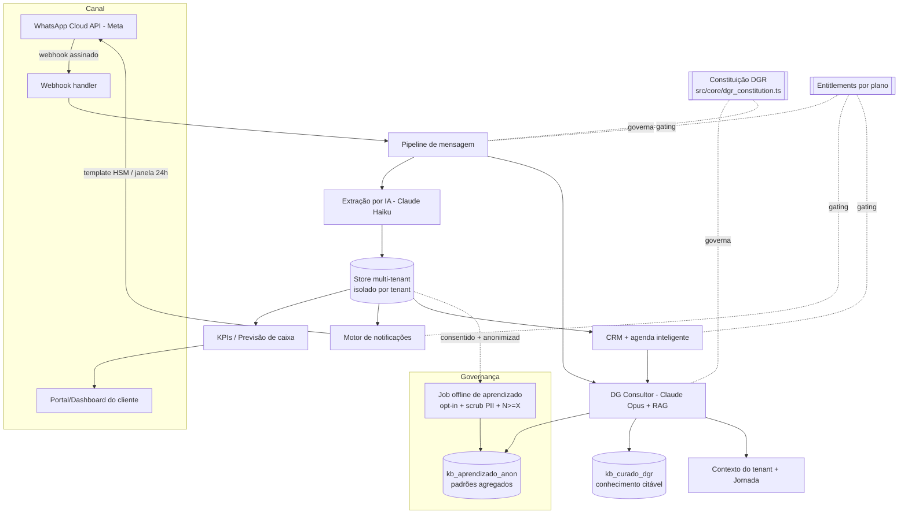

# 04 — Arquitetura da Plataforma DGR

> Fase 2 do PROMPT MESTRE. SaaS **multi-tenant B2B** que entrega o Método Gestão em
> Resultado™. Esta arquitetura está **implementada como código de referência** neste
> repositório (`/src`), com o núcleo de valor rodando ponta a ponta (ver `npm run demo`).
>
> Lastro de pesquisa (Fase 0): `docs/pesquisa/01..04`. Inventário do site: `docs/03_inventario_site_atual.md`.
> Data: 2026-06-29.

## 1. Visão geral

O pipeline genérico de referência ("mensagem WhatsApp → IA → dado estruturado → dashboard +
automações") vem de `docs/pesquisa/01_arquitetura_automacao_whatsapp.md`, **adaptado a B2B**:
o sujeito é o **dono da PME** (retrabalho de lançamento, recebíveis sem conciliação, caixa
imprevisível), não um usuário de finança pessoal.

## 2. Componentes (mapa código ↔ responsabilidade)

| Componente | Arquivo(s) | Responsabilidade |
|---|---|---|
| **Constituição (governa tudo)** | `src/core/dgr_constitution.ts` | Missão/visão/valores/lema/regras como constantes; bloco para o system prompt do DG. |
| **Entitlements (gating)** | `src/core/entitlements.ts` | Matriz planos × recursos (§7.1); `requireFeature`, sugestão de upgrade. |
| **Jornada Diagnóstico→Lucro** | `src/core/journey.ts` | Máquina de estados por tenant; espelha o Método; prioriza plano por impacto (Regra nº 8). |
| **Modelo de dados** | `src/core/types.ts` | Tenant, Transaction, Receivable, Payable, Lead, AgendaItem, User — tudo por `tenantId`. |
| **Finanças/KPIs** | `src/core/finance.ts` | entra/sai/sobra, saldo, recebíveis, **projeção de caixa** + 1º dia negativo. |
| **Conciliação de recebíveis** | `src/core/conciliacao.ts`, `src/services/conciliacaoService.ts` | Casa receita × recebível (contraparte+valor+data); baixa automática (Pro+) ou sugerida (Starter). Elimina divergências. |
| **Régua de cobrança** | `src/notifications/regua.ts` | Dunning escalonado (antes/no dia/depois) ancorado no vencimento; gating: Starter sem régua, Pro básica, Enterprise completa. |
| **DG — extração** | `src/dg/extraction.ts` | "recebi 350 da Maria pelo pix" → JSON; limiar de confirmação. Modelo barato (COGS). |
| **DG — consultor** | `src/dg/consultant.ts`, `src/dg/prompt.ts` | RAG + contexto + jornada → conselho; gating do `dg_consultor`. |
| **RAG (2 coleções)** | `src/dg/rag.ts` | `kb_curado_dgr` (citável) **separado** de `kb_aprendizado_anon` (interno). |
| **Cliente Claude** | `src/dg/anthropic.ts` | Wrapper fino (fetch); modelos por tarefa; cliente mock p/ demo sem custo. |
| **WhatsApp Cloud API** | `src/whatsapp/cloudApi.ts` | Verificação webhook, **assinatura HMAC**, parse inbound, envio texto/template. |
| **Pipeline** | `src/pipeline.ts` | mensagem → extrai → persiste → responde; o "coração" do MVP. |
| **Notificações** | `src/notifications/engine.ts` | Contas a pagar/receber, caixa baixo, **risco de caixa negativo** (proativo). |
| **CRM + agenda** | `src/crm/crm.ts` | Leads/pipeline, follow-ups, **capacidade × oportunidade**, sugestão de abordagem do DG. |
| **Aprendizado anonimizado** | `src/learning/anonymization.ts` | opt-in + scrub PII + limiar N≥X + coleção separada (Regra nº 7 / §5.4). |
| **Store** | `src/store/memoryStore.ts` | Isolamento por tenant (referência; troca por Postgres+RLS em produção). |
| **Servidor** | `src/server.ts` | Webhook + API de dashboard + endpoint de mensagem (demo). |
| **Persona DG** | `prompts/dg_consultor.md` | System prompt versionado, testável, auditável. |

## 3. Pipeline WhatsApp (B2B)

1. **Ingestão:** webhook da Cloud API → validação de assinatura (`X-Hub-Signature-256`) →
   `parseInbound` (texto/áudio). Áudio só em planos com `whatsapp_lancamento_audio` (gating).
2. **Extração (IA):** `extractEntry` pede JSON estrito ao modelo **barato** e classifica a
   intenção: `lancamento | recebivel | compromisso | consulta_gestao | outro`.
3. **Validação:** abaixo do limiar de confiança, o DG **pede confirmação** antes de persistir.
4. **Persistência:** transação/recebível/compromisso isolados por tenant.
5. **Resposta:** confirmação curta + KPI relevante, ou — se for dúvida de gestão — resposta
   do **DG consultor** com RAG.

## 4. DG, o consultor

System prompt montado em `src/dg/prompt.ts` na ordem: **Constituição → persona (md) →
contexto do tenant → situação operacional → jornada → RAG curado → aprendizados anonimizados**.
Regra nº 1 embutida: sem evidência na base, o DG **declara que não tem evidência** e sugere
validar — não inventa. Cada recomendação vem com o **porquê** (§5.2).

## 5. Matriz de planos × recursos (§7.1 — implementada em `entitlements.ts`)

| Recurso / Plataforma | Starter (R$397) | Pro (R$897) | Enterprise (R$1.790) |
|---|---|---|---|
| Bot WhatsApp — lançamentos por texto | full | full | full |
| Lançamentos por áudio (transcrição) | — | full | full |
| DG consultor (perguntas de gestão) | limited (FAQ) | full | priority |
| Dashboard KPIs | basic | full | priority (customizável) |
| Conciliação de recebíveis | limited (assistida) | full (automática) | priority (+régua) |
| CRM com agenda inteligente | — | basic | priority (+sugestão de abordagem) |
| Notificações de caixa (WhatsApp) | basic | full | priority (proativas) |
| Agenda/lembretes WhatsApp | — | full | full |
| Integração Open Finance | — | limited (add-on) | full |
| Relatórios recorrentes | basic (mensal) | full (semanal) | priority (sob demanda) |
| Acompanhamento de consultor humano | — | basic (mensal) | priority (quinzenal) |
| SLA de resposta | 48h | 24h | 8h |
| Onboarding | Self | Assistido | Full Automation |

> ⚠️ **Hipótese a validar** contra margem ≥ 70% e CAC payback ≤ 3 meses. A pesquisa
> `02_modelos_consultoria_pme.md` apontou que **CAC ≤ R$400, payback ≤ 3m e NPS ≥ 70 estão
> agressivos** vs. benchmark B2B Brasil — ver `docs/05_pendencias.md`. O `dg_consultor` em
> `limited` no Starter e o áudio só no Pro+ são as principais alavancas de COGS por plano.

## 6. Segurança, LGPD e governança de dados

- **Isolamento por tenant** em toda leitura/escrita (`assertTenant`); em produção, Postgres
  com Row-Level Security.
- **Retroalimentação entre empresas** (§5.4) com as 6 travas do padrão da indústria de IA
  (lastro: `04_governanca_dados_retroalimentacao.md`): job **offline**, **opt-in** por tenant,
  **scrub de PII**, **limiar N≥X**, **coleção separada/curada**, **retenção/reversibilidade**.
  Testes em `test/platform/privacy.test.ts`.
- **WhatsApp**: somente Cloud API oficial (Regra nº 3); opt-in, janela 24h e templates HSM.
- **Segredos** fora do versionamento (`.gitignore`, `.env.example`).

## 7. Controle de custo de LLM (mitiga risco de COGS)

- **Modelo por tarefa**: extração usa modelo **barato** (`DGR_MODEL_EXTRACTION`, default Haiku);
  consultoria usa modelo capaz (`DGR_MODEL_CONSULTANT`, default Opus). Configurável por env.
- **Gating** reduz chamadas caras em planos baixos (`dg_consultor: limited`).
- **Confirmação determinística** evita reprocessar; **cache de persona**; RAG limita tokens
  de contexto ao `topK` por plano.
- Próximos: cache de respostas frequentes, batch para o job de aprendizado.

## 8. Stack proposta (justificada por dado, ver `01_arquitetura_automacao_whatsapp.md`)

| Camada | Escolha de referência | Justificativa |
|---|---|---|
| Backend | Node/TypeScript (MVP zero-dep; em produção Fastify) | Mesma linguagem do front (Vite/React do site atual); ecossistema da Cloud API; ver inventário. |
| IA | **Anthropic API (Claude)** | Recomendada pelo prompt; contas business/API **excluídas do treino por padrão** (governança §5.4). |
| WhatsApp | **WhatsApp Cloud API (Meta)** ou BSP homologado | Regra nº 3; mitiga risco de bloqueio. |
| Banco | Postgres (+ pgvector para RAG) | Multi-tenant com RLS; vetorial nativo evita 2º banco. |
| Fila/worker | Redis + worker (ou Celery-like) | Webhook responde rápido; processamento e jobs assíncronos (extração, notificações, aprendizado). |
| Hospedagem | Container (Fly/Render/Cloud Run) | Simples para operação enxuta; escala horizontal do worker. |

> A escolha de banco/fila acima é **referência de produção**; o MVP deste repositório usa
> store em memória para provar o fluxo sem infraestrutura. As interfaces (`MemoryStore`,
> `KnowledgeBase`, `ClaudeClient`, `WhatsAppSender`) foram desenhadas para trocar o backend
> sem mexer na lógica de domínio.

## 9. Evolução do front (decisão da Fase 1)

Recomendação do inventário (`docs/03_inventario_site_atual.md`): **migrar o front para
repositório próprio (Vite/Next + Tailwind) preservando 100% da identidade visual** (cores
oficiais já em `dgr_constitution.BRAND`). Pendência: liberar acesso/export do Lovable (Andre).
