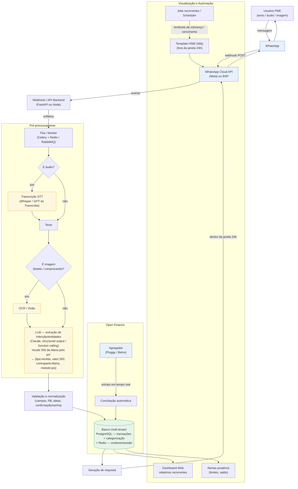

# Arquitetura de Plataformas de Automação Financeira por WhatsApp — Pesquisa de Referência de Mercado

- **Documento:** 01 — Arquitetura de Automação Financeira via WhatsApp
- **Data:** 2026-06-29
- **Autor:** Pesquisa Fase 0 DGR
- **Plataforma:** DGR Gestão em Resultado (consultoria B2B + automação financeira via WhatsApp para PMEs brasileiras)

> **REGRA DE OURO APLICADA NESTE DOCUMENTO:** toda afirmação técnica, de produto ou de preço carrega fonte (URL + data de acesso = 2026-06-29). Onde não foi possível comprovar com fonte pública, o texto traz literalmente **"NÃO COMPROVADO — validar"**. Diversos sites oficiais (finkai.chat, jota.ai, meuassessor.com) retornaram **HTTP 403** à ferramenta de fetch automatizado; nesses casos, os dados vêm de (a) trechos indexados retornados pela busca web do próprio site oficial e (b) cobertura de imprensa/reviews. Itens que dependeriam de leitura direta da página de preços e não puderam ser confirmados estão marcados como tal.

---

## Sumário

1. [Objetivo e escopo](#1-objetivo-e-escopo)
2. [Visão geral do mercado](#2-visão-geral-do-mercado)
3. [Plataforma: Fink AI](#3-plataforma-fink-ai)
4. [Plataforma: Jota (jota.ai)](#4-plataforma-jota-jotaai)
5. [Plataforma: Meu Assessor](#5-plataforma-meu-assessor)
6. [Plataforma: Oinc](#6-plataforma-oinc)
7. [Outras referências relevantes](#7-outras-referências-relevantes)
8. [Camada de canal: WhatsApp Cloud API, BSP, janela de 24h, templates HSM](#8-camada-de-canal-whatsapp-cloud-api-bsp-janela-de-24h-templates-hsm)
9. [Pipeline de mensagem: ingestão → NLP/LLM → validação → persistência → resposta](#9-pipeline-de-mensagem)
10. [Suporte a texto e áudio (transcrição de voz)](#10-suporte-a-texto-e-áudio-transcrição-de-voz)
11. [Open Finance / agregadores bancários e conciliação automática](#11-open-finance--agregadores-bancários-e-conciliação-automática)
12. [Camada de dados: modelagem, categorização, multi-tenant](#12-camada-de-dados)
13. [Camada de visualização, agendamento e alertas](#13-camada-de-visualização-agendamento-e-alertas)
14. [Stack provável e provedor de LLM](#14-stack-provável-e-provedor-de-llm)
15. [Padrões de arquitetura comuns](#15-padrões-de-arquitetura-comuns)
16. [Diagrama de arquitetura de referência (Mermaid)](#16-diagrama-de-arquitetura-de-referência-mermaid)
17. [Implicações para a DGR](#17-implicações-para-a-dgr)
18. [Fontes](#18-fontes)

---

## 1. Objetivo e escopo

Mapear, **com fontes públicas**, como se constrói uma plataforma de automação financeira por WhatsApp, usando como referências de mercado Fink AI, Jota, Meu Assessor, Oinc e correlatos. O documento serve de base técnica e de produto para a Fase 0 da DGR.

Cada plataforma é analisada nas dimensões pedidas: canal/infra, pipeline de mensagem (ingestão → extração de intenção/entidades → validação → persistência → resposta), suporte a texto e áudio, Open Finance/conciliação, camada de dados (multi-tenant/categorização), visualização (dashboard/relatórios/alertas), agendamento/lembretes, stack provável e modelo de negócio/preço.

---

## 2. Visão geral do mercado

Existe em 2026 uma categoria consolidada de "assistentes financeiros no WhatsApp" no Brasil, geralmente PF-first, com IA conversacional que registra receitas/despesas por texto e áudio, conecta contas via Open Finance e oferece dashboard web complementar. Players citados publicamente na mesma categoria incluem Fink AI, Jota, Meu Assessor, Poupa.ai, ZapGastos, GranaZen e POQT [F11][F12][F13][F14].

| Plataforma | Foco | Canal principal | Preço público (2026) | Modelo |
|---|---|---|---|---|
| Fink AI | PF (controle de gastos) | WhatsApp + dashboard | R$ 57/ano (~R$ 4,75/mês) [F1][F5] | Assinatura |
| Jota | PF + PMEs/MEI (conta digital) | 100% WhatsApp | Gratuito (essenciais) [F2][F4] | Float/crédito/maquininha (futuro) |
| Meu Assessor | PF (finanças + agenda + tarefas) | WhatsApp + painel | ~R$ 19,90–29,90/mês [F6][F15] | Assinatura |
| Oinc | PF (agregador + metas) | App mobile (IA em desenvolvimento) | R$ 14,90/mês, 30 dias grátis [F7] | Assinatura |

---

## 3. Plataforma: Fink AI

**Site:** finkai.chat / lp.finkai.chat / app.finkai.chat [F1][F11].

**Posicionamento e funcionamento.** Assistente financeiro pessoal "100% no WhatsApp"; aceita **texto e áudio**, organiza automaticamente receitas/despesas e mostra "quanto entra, quanto sai e quanto sobra". O usuário registra transações com mensagens (o material sugere iniciar com "gastei" ou "recebi" seguido de valor e descrição), recebe alertas, consulta saldos e acompanha em **dashboard em tempo real** [F1][F11].

- **Canal/infra:** WhatsApp como canal único de operação + dashboard web. Provedor de BSP/Cloud API específico **NÃO COMPROVADO — validar**.
- **Pipeline de mensagem:** ingestão por WhatsApp → interpretação por IA do tipo/valor/descrição → registro automático → resposta/saldo. O exemplo "gastei/recebi + valor + descrição" indica extração de intenção e entidades a partir de linguagem natural [F1][F11].
- **Texto e áudio:** suportados (registro por áudio confirmado em material oficial e reviews) [F1][F8].
- **Open Finance:** conexão opcional ao banco "para organizar os movimentos com mais praticidade" / "tornar a organização ainda mais automática" [F1][F5].
- **Dados/visualização:** dashboard em tempo real; limites/orçamentos; relatórios; alertas [F1].
- **Stack:** **NÃO COMPROVADO — validar** (não há material público de engenharia da Fink).
- **Modelo de negócio e preço:** assinatura. Plano anual **R$ 57/ano**, equivalente a **~R$ 4,75/mês**; existem **Plano Casal** e **Plano Família** [F1][F5]. Valores exatos de Casal/Família **NÃO COMPROVADOS — validar** (página de preços retornou 403 ao fetch).

---

## 4. Plataforma: Jota (jota.ai)

**Site:** jota.ai [F2][F9]. **Fundador/CEO:** Davi Holanda (ex-fundador/CEO da Bankly — BaaS adquirida pelo Banco BV em 2023; ex-diretor na PagSeguro) [F16][F17].

**Posicionamento e funcionamento.** Assistente financeiro e pessoal com IA **100% dentro do WhatsApp**, atendendo PF e pequenos negócios/MEI. Diferente dos demais, o Jota é também uma **conta digital** operada no chat: Pix (inclusive por áudio e por imagem/foto de boleto), pagamento de boletos, transferências, Conta Rende Mais (rende 100% do CDI, sem IOF, liquidez diária), Open Finance integrado e automação de tarefas/lembretes [F2][F4][F9].

- **Canal/infra:** 100% WhatsApp, do onboarding às operações financeiras. Suporta **texto, áudio e imagem** [F4][F9].
- **Infra bancária:** usa a plataforma **Banking as a Service da Celcoin**; para fins regulatórios, a conta é da Celcoin (instituição regulada pelo BC); custódia do dinheiro na Celcoin [F2][F18].
- **Pipeline de mensagem:** ingestão multimodal (texto/áudio/imagem) → IA conversacional interpreta intenção (ex.: "fazer um Pix por áudio", "pagar este boleto a partir da foto") → validação de identidade/senha de 6 caracteres por transação → execução via infra bancária → resposta [F2][F4].
- **Open Finance:** integrado — conecta contas de diferentes bancos e acompanha tudo em um único chat [F2][F4].
- **Segurança:** validação de identidade no cadastro; senha de 6 caracteres por transação; custódia na Celcoin [F2][F4].
- **Stack:** "plataforma de IA conversacional" sobre infra Celcoin; detalhes de engenharia internos **NÃO COMPROVADOS — validar**.
- **Modelo de negócio e preço:** o Jota se posiciona como **100% gratuito** para Pix, boletos, transferências e uso da IA; a monetização futura prevista é via **operações de crédito e maquininhas** (modelo de banco/float) [F2][F4]. Captação: **rodada Seed de US$ 8,9 milhões**, liderada pela MAYA Capital (com HOF Capital, BigBets, Alter Global, Bogari Capital, Norte Ventures e anjos) [F16][F17].

> Observação estratégica: o Jota é o player mais "fintech/banco" (infra regulada, conta transacional) e o de modelo de receita mais distinto (não cobra do usuário). É uma referência de produto, mas seu modelo de negócio não é diretamente replicável por uma consultoria sem licença/parceria BaaS.

---

## 5. Plataforma: Meu Assessor

**Site:** meuassessor.com [F6].

**Posicionamento e funcionamento.** "Assessor pessoal por IA no WhatsApp" — mais amplo que só finanças: organiza **finanças, agenda, tarefas, projetos, cobranças e documentos**, por comandos de voz ou texto, com painel/dashboard web complementar, Open Finance e integração com Google Agenda [F6][F15].

- **Canal/infra:** operação do dia a dia pelo WhatsApp + **dashboard analítico via navegador** (relatórios, gráficos, acompanhamento de projetos), sem precisar baixar app [F6][F15].
- **Texto e áudio:** suportados (comandos por voz ou texto) [F6].
- **Open Finance:** conecta Nubank, Itaú, Bradesco, Santander, Inter e **mais de 110 instituições** via Open Finance [F6][F15].
- **Dados/visualização:** painel completo; categorização de finanças; gestão de tarefas/projetos/cobranças [F6].
- **Segurança/compliance:** material cita "segurança de nível bancário com criptografia de ponta a ponta" e proteção LGPD (afirmações de marketing — verificar tecnicamente) [F6].
- **Stack:** **NÃO COMPROVADO — validar**.
- **Modelo de negócio e preço:** assinatura. Faixa pública citada em reviews/material: **~R$ 19,90 a R$ 29,90/mês** dependendo da oferta; há menção de plano completo promocional por **R$ 19,90/mês** e plano anual em torno de **R$ 29,90/mês** (descrições de fontes conflitam — **valores exatos a validar na página oficial**, que retornou 403 ao fetch) [F6][F15]. Uma fonte de blog concorrente estima genericamente "R$ 20–50/mês" para assessores pagos como o Meu Assessor [F3] — tratar como estimativa de terceiro, **não** como preço oficial.

---

## 6. Plataforma: Oinc

**Site:** useoinc.com.br; apps na App Store e Google Play [F7].

**Posicionamento e funcionamento.** Diferentemente dos demais, o Oinc é primariamente um **app mobile** de finanças pessoais (não um bot de WhatsApp). Agrega contas e cartões via **Open Finance**, organiza despesas por categoria automaticamente, oferece gráficos/relatórios mensais, orçamento com limites e o recurso "Trocadinho" (arredondamento de centavos para guardar/investir) [F7].

- **Canal/infra:** app iOS/Android. IA conversacional ainda **em desenvolvimento** (a fintech declara desenvolver IA para simplificar a experiência, a lançar "quando estiver pronta e segura") — **não há, hoje, fluxo de WhatsApp comprovado** [F7].
- **Open Finance:** núcleo do produto (visão unificada de contas/cartões) [F7].
- **Dados/visualização:** categorização automática, gráficos e relatórios mensais, orçamento por limites [F7].
- **Stack:** **NÃO COMPROVADO — validar**.
- **Modelo de negócio e preço:** assinatura **R$ 14,90/mês** com **30 dias grátis** para teste [F7].

> Observação: incluído por ser referência de **agregação/categorização/Open Finance** e de **modelo de assinatura PF**, mas é o caso menos aderente ao recorte "automação por WhatsApp" — o canal conversacional ainda não é público.

---

## 7. Outras referências relevantes

Citadas na mesma categoria pela busca pública, úteis para benchmarking de canal e preço (detalhes individuais **a validar caso a caso**): **Poupa.ai** (assistente financeiro PF no WhatsApp com IA), **ZapGastos**, **GranaZen** ("controle financeiro inteligente com WhatsApp e IA") e **POQT** (posiciona-se como bot financeiro pioneiro/completo no WhatsApp) [F11][F12][F13][F14].

No lado de **infraestrutura de Open Finance/agregação**, os fornecedores recorrentes no mercado brasileiro são **Pluggy** e **Belvo** — conectores para os principais bancos, SDK/widget de conexão, dados + pagamentos + conciliação [F10][F19].

---

## 8. Camada de canal: WhatsApp Cloud API, BSP, janela de 24h, templates HSM

Fontes: documentação Meta + guias 2026 [F20][F21][F22].

- **WhatsApp Cloud API (Meta):** versão hospedada pela Meta da WhatsApp Business Platform; permite conectar sistemas ao WhatsApp sem servidores próprios do WhatsApp [F21].
- **BSP (Business Solution Provider):** empresa certificada pela Meta que distribui acesso à plataforma, intermedia a infra da Meta, gerencia o número na API, emite nota em BRL e dá suporte local [F21]. Alternativa: integrar direto na Cloud API da Meta.
- **Webhooks:** em produção, o webhook notifica seu servidor a cada mensagem recebida, mudança de status de entrega e eventos de leitura. O fluxo típico: Meta faz **POST** ao seu endpoint (webhook) → você processa → responde via função de envio [F21][F23].
- **Janela de 24h:** quando o cliente envia a primeira mensagem, a empresa tem **24h** para responder em qualquer formato, sem template. Após 24h sem resposta, a janela fecha e qualquer mensagem ativa da empresa exige **template aprovado** [F21].
- **Templates HSM:** pré-requisito para envios fora da janela de 24h. Em 2026 dividem-se em **Marketing** (requer opt-in), **Utility** (confirmações/lembretes) e **Authentication** (OTP/2FA) [F21][F24].
- **Opt-in:** exigido para marketing; recomenda-se documentar a origem do opt-in em ao menos dois pontos de captura (formulário no site, PDV, CRM) [F21].
- **Precificação (modelo per-message desde jul/2025):** a Meta passou de cobrança por janela de conversa (24h) para **cobrança por mensagem entregue**. Faixas estimadas para o Brasil em 2026: **Utility ~R$ 0,04–0,05/msg**, **Authentication ~R$ 0,15–0,19/msg**, **Marketing ~R$ 0,31–0,38/msg**, e **R$ 0** para mensagens de serviço iniciadas pelo cliente dentro da janela de 24h. BSPs cobram margem operacional adicional (tipicamente 10–30%) [F25][F26]. **Validar com a tabela oficial da Meta** [F26] antes de fechar pricing.

---

## 9. Pipeline de mensagem

**Fluxo genérico (ingestão → extração de intenção/entidades → validação → persistência → resposta).** Padrão reconstruído a partir de material técnico público sobre integração WhatsApp Cloud API + LLM [F23][F27][F28]:

1. **Ingestão:** Meta envia POST ao webhook a cada mensagem (texto, áudio, imagem) [F23].
2. **Pré-processamento:** se for áudio, baixar mídia e transcrever (ver seção 10); se imagem (boleto/comprovante), OCR/visão.
3. **Extração de intenção/entidades (NLP/LLM):** a frase em linguagem natural é convertida em estrutura. Exemplo-alvo:
   - Entrada: *"recebi 350 da Maria pelo pix"*
   - Saída estruturada: `{ "tipo": "receita", "valor": 350.00, "contraparte": "Maria", "metodo": "pix" }`
   - Técnica recomendada: **LLM com saída estruturada / function calling** (o LLM extrai parâmetros do texto livre e os vincula a campos de uma função/registro). NLP clássico identifica intenção; o LLM gera resposta humanizada e estrutura os dados [F27][F28].
4. **Validação:** checar campos obrigatórios (valor numérico, tipo, data), normalizar (R$, vírgula/ponto, datas relativas como "ontem"), e — em fluxos transacionais — exigir confirmação/senha (modelo Jota: senha de 6 caracteres por transação) [F4][F27].
5. **Persistência:** gravar a transação no banco, vinculada ao tenant/usuário, com categoria.
6. **Resposta:** confirmar ao usuário (saldo atualizado, categoria atribuída) na mesma conversa; dentro da janela de 24h não exige template [F21][F23].

Para contexto conversacional, armazena-se histórico (Redis/Postgres/Mongo) e inclui-se nas chamadas ao LLM [F23][F28].

---

## 10. Suporte a texto e áudio (transcrição de voz)

Texto é nativo; **áudio** (mensagem de voz do WhatsApp) requer baixar a mídia e transcrever via STT. Fink, Jota e Meu Assessor declaram suporte a voz [F1][F4][F6].

Opções e custos de transcrição (referência OpenAI, jun/2026) [F29]:

| Modelo | Custo aproximado |
|---|---|
| Whisper / GPT-4o Transcribe | ~US$ 0,006/min (~US$ 0,36/h) |
| GPT-4o **mini** Transcribe | ~US$ 0,003/min (~US$ 0,18/h) |
| Transcrição realtime (deltas ao vivo) | ~US$ 0,017/min |

Formatos aceitos: MP3, MP4, WAV, M4A; limite de 25 MB por arquivo [F29]. Para WhatsApp, é necessário extrair o áudio do payload da mídia e enviá-lo à API de transcrição (lógica de integração própria) [F29]. Alternativas auto-hospedadas (Whisper open-source) existem para reduzir custo por minuto a escala — **trade-off de infra a validar**.

---

## 11. Open Finance / agregadores bancários e conciliação automática

Fontes: Pluggy, Belvo, blog Jota [F10][F19][F30].

- **Open Finance Brasil:** evolução do Open Banking; compartilhamento de dados financeiros entre instituições mediante consentimento do usuário, implementado em fases desde 2021 [F10][F30].
- **Agregadores:** **Pluggy** ("nasceu dentro do Open Finance"; API única que conecta dados bancários, pagamentos, extratos, conciliações; SDK e widget de conexão pronto) e **Belvo** (plataforma líder de dados e pagamentos de Open Finance na América Latina) [F10][F19].
- **Conciliação automática:** caso de uso de adoção mais rápida — elimina o processo manual de OFX sem exigir mudança de comportamento do cliente. Em vez de importar arquivos, o sistema conecta direto aos bancos e acessa dados em tempo real (com autorização do usuário), e as transações chegam prontas para conciliação automática no ERP/plataforma [F10]. Para conciliação automática mais profunda contra contas a receber, cobrança automática e webhook, estima-se **2 a 4 sprints adicionais** de trabalho [F10].

> Para a DGR: a conciliação OFX manual (fluxo já existente nos skills do repositório — `conciliar`, `baixar-cp`, `preencher-cr`, `fluxo-caixa`) é exatamente o processo que o Open Finance automatiza. Há um caminho de evolução: do OFX manual → agregador (Pluggy/Belvo) → conciliação automática.

---

## 12. Camada de dados

Padrões observados/recomendados (consolidado das plataformas e de material de arquitetura) [F1][F6][F7][F28]:

- **Modelagem de transações:** registro mínimo `{ tenant_id, usuario_id, tipo (receita/despesa), valor, data, contraparte, metodo (pix/boleto/cartão/dinheiro), categoria, origem (texto/áudio/imagem/openfinance), id_consentimento_of }`. (Esquema proposto pela DGR; **validar** contra requisitos reais.)
- **Categorização:** automática por IA/regras — confirmada como recurso em Fink, Meu Assessor e Oinc (despesas organizadas por categoria) [F1][F6][F7].
- **Multi-tenant:** essencial para B2B/PME. Padrões usuais: isolamento por `tenant_id` em esquema compartilhado, ou schema/DB por tenant. Implementação específica das plataformas analisadas **NÃO COMPROVADA — validar**; é decisão arquitetural da DGR.
- **Armazenamento de contexto conversacional:** Redis/Postgres/Mongo para histórico por usuário [F28].

---

## 13. Camada de visualização, agendamento e alertas

- **Dashboard web:** Fink (tempo real), Meu Assessor (painel analítico no navegador: relatórios, gráficos, projetos), Oinc (gráficos/relatórios mensais no app) [F1][F6][F7].
- **Relatórios recorrentes:** relatórios completos/mensais citados por Fink, Meu Assessor e Oinc [F1][F6][F7].
- **Alertas proativos:** Fink cita alertas e limites; Meu Assessor cita cobranças/lembretes [F1][F6].
- **Agendamento/lembretes e follow-up:** Jota e Meu Assessor citam automação de tarefas, agendamento de lembretes/vencimentos e rotinas; Jota integra automação de tarefas financeiras com IA conversacional [F2][F4][F6]. Implementação típica: **jobs recorrentes** (cron/worker) disparando templates HSM de **Utility** (lembrete de cobrança/vencimento) fora da janela de 24h [F21][F24].

---

## 14. Stack provável e provedor de LLM

As plataformas analisadas **não publicam** sua stack de engenharia (**NÃO COMPROVADO — validar** em cada caso). O que segue é uma **stack de referência** para a DGR, baseada em material técnico público de integração WhatsApp + LLM [F23][F28]:

- **Backend / API:** FastAPI (Python) ou Node — recebe webhooks da Cloud API [F28].
- **Fila/worker assíncrono:** Celery + Redis (broker) ou RabbitMQ — descarrega a geração de resposta do LLM e a transcrição de áudio, mantendo o webhook responsivo [F28].
- **Banco:** PostgreSQL (transações, multi-tenant) + Redis (cache/contexto/sessão) [F28].
- **LLM (provedor):** decisão da DGR. Para extração de intenção/entidades em português com saída estruturada e custo controlado, a recomendação é usar a **API da Anthropic (Claude)** com **structured outputs / function calling** e roteamento por modelo conforme a tarefa:

  | Modelo Claude | ID exato | Preço (US$/1M tokens, in/out) | Uso sugerido |
  |---|---|---|---|
  | Claude Haiku 4.5 | `claude-haiku-4-5` | US$ 1,00 / US$ 5,00 | Extração/classificação de alto volume e baixa latência (registro de transação) |
  | Claude Sonnet 4.6 | `claude-sonnet-4-6` | US$ 3,00 / US$ 15,00 | Conversas/relatórios de complexidade média |
  | Claude Opus 4.8 | `claude-opus-4-8` | US$ 5,00 / US$ 25,00 | Raciocínio complexo / análises financeiras |

  Fonte de preços/IDs: catálogo de modelos da skill `claude-api` (cache 2026-06-04) [F31]. **Validar contra a página oficial de pricing** antes de fechar custos [F32]. Para o caso de uso "frase → JSON estruturado", o padrão é `messages` com `output_config.format` (JSON Schema) ou `tools` com `strict: true`, e **prompt caching** para baratear o system prompt repetido [F31].

- **Transcrição:** ver seção 10 (OpenAI Whisper/GPT-4o Transcribe ou Whisper auto-hospedado) [F29].
- **Open Finance:** Pluggy ou Belvo [F10][F19].
- **Hospedagem:** cloud padrão (não comprovado por plataforma); para a DGR, qualquer PaaS/contêiner que suporte webhook público HTTPS, worker e Postgres.

---

## 15. Padrões de arquitetura comuns

Sintetizando as quatro plataformas + material técnico:

1. **WhatsApp como front-end conversacional único**, com dashboard web como camada de visualização complementar (Fink, Meu Assessor; Jota é 100% chat; Oinc é app-first) [F1][F2][F6][F7].
2. **Ingestão multimodal** (texto/áudio, e imagem nos mais avançados) via webhook da Cloud API [F4][F23].
3. **LLM no centro do pipeline** para extrair intenção/entidades e gerar resposta humanizada, com saída estruturada para persistência [F27][F28].
4. **Open Finance como motor de automação/conciliação**, frequentemente via agregador (Pluggy/Belvo) [F10][F19].
5. **Camada de dados com categorização automática e multi-tenant** [F1][F6][F7].
6. **Automação proativa** (alertas, lembretes, follow-up de cobrança) via jobs recorrentes + templates HSM Utility fora da janela de 24h [F21][F24].
7. **Modelos de negócio:** assinatura PF de baixo ticket (Fink ~R$ 4,75/mês; Oinc R$ 14,90/mês; Meu Assessor ~R$ 19,90–29,90/mês) **vs.** modelo banco/float gratuito ao usuário (Jota), monetizando crédito/maquininha [F1][F2][F6][F7].
8. **Infra bancária via BaaS** quando há transação real (Jota → Celcoin) — exige parceria/licença, não replicável por consultoria pura [F2][F18].

---

## 16. Diagrama de arquitetura de referência (Mermaid)

Pipeline genérico "mensagem WhatsApp → IA → dado estruturado → dashboard + automações", base para a DGR:

---

## 17. Implicações para a DGR

- **Aderência ao repositório atual:** os skills existentes (`conciliar`, `baixar-cp`, `preencher-cr`, `fluxo-caixa`, `conciliar-boletos`) já implementam conciliação OFX/boletos manual. O salto natural é (a) canal WhatsApp para ingestão de lançamentos por linguagem natural e (b) Open Finance (Pluggy/Belvo) para substituir a conciliação OFX manual por automática [F10][F19].
- **Diferenciação B2B:** os concorrentes são majoritariamente PF. A DGR (consultoria B2B + PME) pode posicionar multi-tenant + conciliação + relatórios para o consultor, não só para o dono.
- **Canal:** começar pela **Cloud API direta da Meta** ou via **BSP** (avaliar margem 10–30%); modelar custo per-message (Utility para lembretes é barato; Marketing exige opt-in e é mais caro) [F21][F25][F26].
- **LLM:** Claude com saída estruturada (Haiku para extração em volume; Sonnet/Opus para análise), com prompt caching [F31].
- **Não replicar cegamente o Jota:** seu modelo (conta digital gratuita) depende de BaaS regulado (Celcoin) e receita de crédito/float — fora do escopo de uma consultoria sem licença [F2][F18].

---

## 18. Fontes

Todas acessadas em **2026-06-29**. Itens marcados como "via busca" tiveram a página oficial retornando HTTP 403 ao fetch automatizado; o conteúdo veio de trechos indexados da busca web do próprio site oficial e/ou cobertura de imprensa.

- **[F1]** Fink AI — site oficial: https://finkai.chat/ (via busca; HTTP 403 no fetch direto)
- **[F2]** Jota — site oficial: https://jota.ai/ e https://jota.ai/como-funciona (via busca; HTTP 403 no fetch direto)
- **[F3]** Blog Jota — "Assessor WhatsApp vale a pena? Jota vs concorrentes 2026": https://blog.jota.ai/assessor-whatsapp-vale-a-pena/
- **[F4]** Mobile Time — "Jota: nasce assistente financeiro 100% no WhatsApp" (24/02/2025): https://www.mobiletime.com.br/noticias/24/02/2025/jota-whatsapp/
- **[F5]** Diário da Manhã — "Fink AI: veja como brasileiros estão com mais dinheiro sobrando…": https://www.dm.com.br/brasil/fink-ai-veja-como-brasileiros-estao-com-mais-dinheiro-sobrando-no-fim-do-mes-ao-usar-essa-ia-para-controle-financeiro/
- **[F6]** Meu Assessor — site oficial: https://meuassessor.com/ (via busca; HTTP 403 no fetch direto)
- **[F7]** Oinc — site oficial: https://www.useoinc.com.br/ ; App Store: https://apps.apple.com/br/app/oinc-finan%C3%A7as-pessoais/id1619012112 ; Google Play: https://play.google.com/store/apps/details?id=br.com.useoinc.oincapp
- **[F8]** Band — "Testamos por 7 dias a Fink AI": https://www.band.com.br/band-vale/noticias/testamos-por-7-dias-a-fink-ai-202601191710
- **[F9]** Jota — página de notícias / como funciona: https://jota.ai/noticias e https://jota.ai/como-funciona
- **[F10]** Pluggy — "Conciliação Bancária: Como o Open Finance pode ajudar" e "API de extrato bancário para ERPs": https://www.pluggy.ai/blog/concilia%C3%A7%C3%A3o-banc%C3%A1ria-open-finance e https://www.pluggy.ai/blog/api-extrato-bancario-erp-sistema-gestao
- **[F11]** A Crítica — "Assistente Financeiro no WhatsApp: 10 motivos para assinar a Fink AI": https://www.acritica.com/geral/assistente-financeiro-no-whatsapp-10-motivos-para-assinar-a-fink-ai-1.394081
- **[F12]** Poupa.ai — site oficial: https://poupa.ai/en
- **[F13]** GranaZen — site oficial: https://granazen.com/
- **[F14]** POQT — "Melhor bot financeiro WhatsApp": https://poqt.cloud/pt/blog/melhor-bot-financeiro-whatsapp ; ZapGastos: https://zapgastos.com/
- **[F15]** Reviews Meu Assessor (preço/funcionalidades): https://tcheseo.com.br/ferramenta-meu-assessor/ e https://cursoetreinamento.com.br/lp/meu-assessor/vale-a-pena/
- **[F16]** Startups.com.br — "Jota capta US$ 8,9M para levar banco no WhatsApp a PMEs": https://startups.com.br/negocios/rodada-de-investimento/jota-capta-us-89m-para-levar-banco-no-whatsapp-a-pmes/
- **[F17]** Empreendedor — "Após aporte de US$ 8,9M, startup lança agente financeiro hiperpersonalizável": https://empreendedor.com.br/tecnologia/inovacao/startup-lanca-agente-financeiro-hiperpersonalizavel/
- **[F18]** Finsiders Brasil — "Com infraestrutura da Celcoin, Jota faz do WhatsApp um 'hub' financeiro inteligente": https://finsidersbrasil.com.br/inovacao/com-infraestrutura-da-celcoin-jota-faz-do-whatsapp-um-hub-financeiro-inteligente/
- **[F19]** Belvo — site oficial: https://belvo.com/
- **[F20]** TechTudo — "10 apps de controle financeiro para 2026": https://www.techtudo.com.br/listas/2026/01/10-apps-de-controle-financeiro-para-cuidar-melhor-do-dinheiro-em-2026-edapps.ghtml
- **[F21]** HelenaCRM — "API Oficial do WhatsApp (Meta): O Guia Completo 2026": https://www.helenacrm.com/post/api-whatsapp-oficial-meta ; Algoritmo Diário — "WhatsApp Business API: guia completo para PMEs brasileiras 2026": https://algoritmodiario.com/artigos/whatsapp-business-api-guia-completo.php
- **[F22]** Zenvia — "WhatsApp Business API: guia completo 2026": https://zenvia.com/blog/whatsapp-business-api-o-que-e-como-funciona-e-vantagens-fundamentais-para-empresas/
- **[F23]** Guilherme Oliveira (Medium) — "Integrando WhatsApp Cloud API com LLMs": https://medium.com/@guigaoliveira_/integrando-whatsapp-cloud-api-com-llms-6141de7d6312
- **[F24]** SocialHub — "Templates WhatsApp API 2026: Como Aprovar": https://www.socialhub.pro/blog/templates-whatsapp-business-api-aprovacao-2026/
- **[F25]** Message Central — "WhatsApp Business API Pricing in Brazil 2026": https://www.messagecentral.com/blog/whatsapp-business-api-pricing-brazil
- **[F26]** Meta — "Pricing on the WhatsApp Business Platform" (fonte oficial a validar): https://developers.facebook.com/documentation/business-messaging/whatsapp/pricing
- **[F27]** Seedts — "Frameworks para criar Agentes de LLM ou IA" / Salesforce — "Agentes de LLM": https://www.seedts.com.br/post/agentes-de-ia e https://www.salesforce.com/br/agentforce/llm-agents/
- **[F28]** GitHub vstorm-co/full-stack-ai-agent-template (FastAPI + Celery + Redis + Postgres) e Towards Data Science — "Building Scalable Chatbots with FastAPI": https://github.com/vstorm-co/full-stack-ai-agent-template e https://towardsdatascience.com/leveraging-llama-2-features-in-real-world-applications-building-scalable-chatbots-with-fastapi-406f1cbeb935/
- **[F29]** OpenAI — Speech to text / preços de transcrição (jun/2026): https://platform.openai.com/docs/guides/speech-to-text e https://diyai.io/ai-tools/speech-to-text/openai-whisper-api-pricing-2026/
- **[F30]** Blog Jota — "O que é Open Finance e como funciona na prática em 2026": https://blog.jota.ai/o-que-e-open-finance-e-como-funciona-na-pratica-open-finance/
- **[F31]** Catálogo de modelos e preços Claude — skill `claude-api` (cache 2026-06-04), referência interna da plataforma Anthropic.
- **[F32]** Anthropic — página oficial de pricing (a validar): https://platform.claude.com/docs/en/pricing

---

*Fim do documento. Itens "NÃO COMPROVADO — validar" e os preços de Fink Casal/Família e Meu Assessor exatos requerem confirmação direta nas páginas oficiais (que bloquearam o fetch automatizado).*
